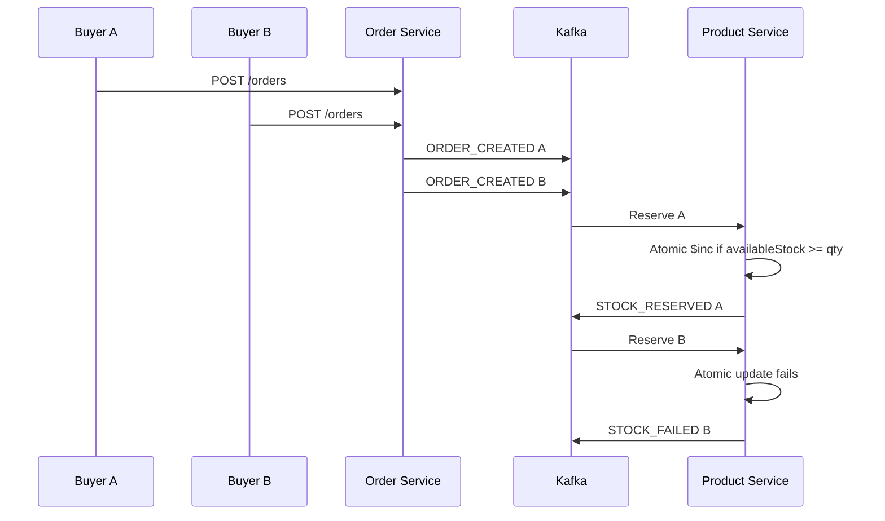
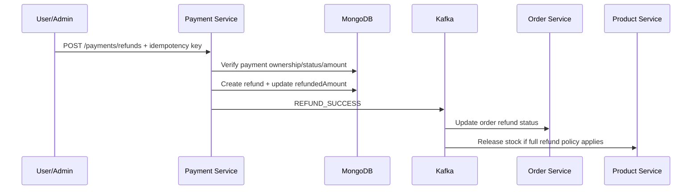
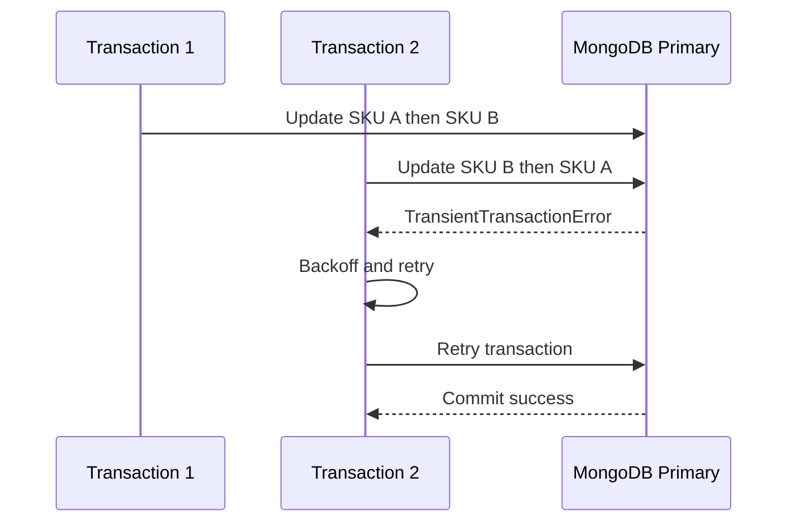
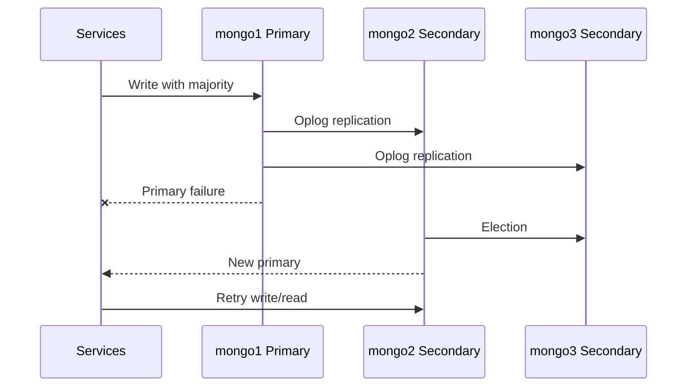

# BÁO CÁO CẬP NHẬT BACKEND CHO HỆ THỐNG CƠ SỞ DỮ LIỆU PHÂN TÁN

## 1. Mục Tiêu Chỉnh Sửa

Mục tiêu của đợt chỉnh sửa là làm backend phù hợp hơn với bài toán Cơ sở dữ liệu phân tán và microservices thương mại điện tử:

- Chống race condition khi nhiều request cùng mua một sản phẩm.
- Chuẩn hóa luồng Saga giữa order, stock, payment và refund.
- Thêm phân quyền `BUYER`, `SELLER`, `ADMIN`.
- Thêm thống kê admin ở các service chính.
- Chống request trùng bằng idempotency/inbox event.
- Hạn chế DDoS bằng budget/rate limit ở API Gateway.
- Dùng MongoDB replica set 3 node thật trong Docker Compose.
- Giữ dữ liệu reservation đủ lâu để phục hồi và audit.
- Thêm báo cáo/sequence diagram phục vụ phần trình bày CSDL phân tán.

## 2. Tổng Quan Trước Khi Sửa

Trước khi chỉnh sửa, backend đã có các service chính:

- `auth-service`: đăng ký, đăng nhập, JWT, user roles.
- `product-service`: sản phẩm, tồn kho, Redis cache.
- `cart-service`: giỏ hàng.
- `order-service`: tạo đơn hàng, phát event Kafka.
- `payment-service`: VNPay callback, payment model, refund model.
- `api-gateway`: Nginx reverse proxy.
- `common`: kết nối DB, Redis, rate limit helper.

Tuy nhiên còn một số rủi ro:

| Vấn đề | Rủi ro |
|---|---|
| Các service tin `userId` từ request body | User có thể giả mạo id người khác |
| Có role trong JWT nhưng route chưa enforce RBAC | `BUYER`, `SELLER`, `ADMIN` chưa thật sự có tác dụng |
| `order-service` gọi trực tiếp `/decrease-stock` rồi vẫn emit `ORDER_CREATED` | Có nguy cơ trừ kho 2 lần |
| Order status và Payment status không thống nhất | Payment thành công nhưng Order không update đúng |
| Refund mới có model, chưa có service xử lý | Chưa chống double refund |
| Kafka consumer chưa có inbox/dedup | Event trùng có thể xử lý lại |
| Service trỏ MongoDB IP ngoài thay vì replica set Docker | Không kiểm chứng đúng failover 3 node |
| Gateway chưa rate limit | Request nhiều có thể dồn thẳng vào service |
| Reservation TTL xóa sớm | Có thể mất bằng chứng phục hồi stock |

## 3. Các Phần Đã Chỉnh Sửa Chi Tiết

### 3.1. Thêm Middleware Xác Thực JWT Và RBAC

**File đã thêm/sửa**

- `services/common/src/middlewares/auth.middleware.js`
- `services/common/index.js`
- `services/auth-service/src/routes/auth.routes.js`
- `services/product-service/src/routes/product.routes.js`
- `services/cart-service/src/routes/cart.routes.js`
- `services/order-service/src/routes/order.routes.js`
- `services/payment-service/src/routes/payment.routes.js`

**Đã sửa gì**

- Thêm middleware `authenticate()` để đọc `Authorization: Bearer <token>`.
- Verify JWT bằng `JWT_SECRET`.
- Gắn thông tin user vào `req.user`:
  - `id`
  - `roles`
- Thêm middleware `authorize(...roles)` để chặn route theo role.
- Thêm helper `hasRole(user, role)` để controller kiểm tra quyền chi tiết.

**Sửa như thế nào**

- Route order/cart yêu cầu user đăng nhập và có role `BUYER` hoặc `ADMIN`.
- Route ghi sản phẩm yêu cầu `SELLER` hoặc `ADMIN`.
- Route thống kê yêu cầu `ADMIN`.
- Route refund yêu cầu `BUYER` hoặc `ADMIN`.

**Mục đích**

- Không để client tự khai báo quyền bằng body.
- Đảm bảo phân quyền thật sự được enforce ở backend.
- Phục vụ mục 1 và mục 2: Admin, customer, seller.

## 3.2. Sửa Auth Register/Login Và Role Trả Về

**File đã sửa**

- `services/auth-service/src/controllers/auth.controller.js`
- `services/auth-service/src/models/User.js`

**Đã sửa gì**

- Register trả về `token` ngay sau khi tạo user.
- Login trả về `roles` trong response.
- Sửa logic `emailHmac` để register và login dùng cùng `GLOBAL_EMAIL_SALT`.
- Không cho user tự tạo role `ADMIN` khi register thường.
- Cho phép tự đăng ký role `BUYER` hoặc `SELLER`.

**Sửa như thế nào**

- `AuthController.signToken()` tạo JWT chứa:
  - `id`
  - `roles`
- `AuthController.sanitizeRoles()` chỉ cho self-register `BUYER/SELLER`.
- `User.pre('save')` hash email bằng global salt thống nhất.

**Mục đích**

- Tránh lỗi đăng ký xong không login được do `emailHmac` không khớp.
- Đảm bảo JWT đủ thông tin để RBAC hoạt động.
- Tránh việc client tự đăng ký thành admin.

## 3.3. Thêm Admin Statistics

**File đã sửa**

- `services/auth-service/src/controllers/auth.controller.js`
- `services/product-service/src/controllers/product.controller.js`
- `services/order-service/src/controllers/order.controller.js`
- `services/payment-service/src/controllers/payment.controller.js`

**Đã sửa gì**

Thêm các endpoint thống kê admin:

- Auth stats:
  - tổng user
  - active user
  - banned user
  - số lượng theo role
- Product stats:
  - tổng sản phẩm
  - sản phẩm active
  - top seller
  - tổng tồn kho, tồn khả dụng, tồn đã giữ
- Order stats:
  - tổng đơn hàng
  - số lượng theo status
  - doanh thu từ đơn đã thanh toán/giao hàng/hoàn tất
- Payment stats:
  - payment theo status
  - captured amount
  - refunded amount
  - refund theo status

**Mục đích**

- Phục vụ mục 1: Admin thống kê, tính toán.
- Tạm thời đặt stats trong từng service để ít phá kiến trúc hiện tại.
- Sau này có thể gom lại thành `admin-service` hoặc read model riêng.

## 3.4. Chuẩn Hóa Saga Order Stock Payment

**File đã sửa**

- `services/order-service/src/services/order.service.js`
- `services/order-service/src/controllers/order.controller.js`
- `services/order-service/src/models/order.model.js`
- `services/order-service/src/services/order.consumer.js`
- `services/product-service/src/services/stock.consumer.js`
- `services/product-service/src/models/stockReservation.model.js`
- `services/payment-service/src/services/vnpay.service.js`

**Trước khi sửa**

Luồng cũ có nguy cơ trừ kho 2 lần:

1. `order-service` gọi HTTP sang `product-service /decrease-stock`.
2. `order-service` vẫn emit `ORDER_CREATED`.
3. `product-service` consumer lại reserve stock lần nữa.

**Đã sửa gì**

Luồng mới:

1. `order-service` chỉ tạo order `PENDING_PAYMENT`.
2. `order-service` emit Kafka event `ORDER_CREATED`.
3. `product-service` nhận event và reserve stock bằng atomic update.
4. Nếu giữ kho thành công, emit `STOCK_RESERVED`.
5. Nếu hết hàng, emit `STOCK_FAILED`.
6. `payment-service` chỉ tạo payment sau khi nhận `STOCK_RESERVED`.
7. Payment callback emit `payment-confirmed`.
8. `order-service` cập nhật trạng thái đơn.
9. `product-service` confirm hoặc release reservation tùy payment/refund event.

**Mục đích**

- Đúng mô hình Saga Choreography.
- Tránh trừ kho 2 lần.
- Giữ service ownership rõ ràng:
  - `order-service` sở hữu order.
  - `product-service` sở hữu stock.
  - `payment-service` sở hữu payment/refund.

## 3.5. Chống Race Condition Khi Mua Hàng

**File đã sửa**

- `services/product-service/src/services/stock.consumer.js`
- `services/product-service/src/models/stockReservation.model.js`

**Đã sửa gì**

- Dùng MongoDB atomic update để giữ kho:
  - `$elemMatch` để đảm bảo match đúng variant.
  - `$inc` để giảm `availableStock`, tăng `reservedStock`.
- Tạo `StockReservation` cho từng item trong order.
- `checkoutId` unique theo order, sku, index.
- Duplicate `ORDER_CREATED` không tạo reservation mới nếu đã có reservation.

**Sửa như thế nào**

Khi nhận `ORDER_CREATED`, product service gọi:

```js
Product.findOneAndUpdate(
  {
    variants: {
      $elemMatch: {
        skuId: requestedSku,
        availableStock: { $gte: qty }
      }
    }
  },
  {
    $inc: {
      'variants.$.availableStock': -qty,
      'variants.$.reservedStock': qty,
      'variants.$.version': 1
    }
  }
)
```

**Mục đích**

- Nếu 2 request cùng mua 1 SKU cuối cùng, chỉ 1 request update thành công.
- Request còn lại nhận `STOCK_FAILED`.
- Phục vụ mục 3: race condition khi 2 người cùng mua một món hàng.

## 3.6. Thêm Inbox Pattern Chống Kafka Event Trùng

**File đã thêm/sửa**

- `services/common/src/models/processedEvent.model.js`
- `services/common/src/events/processedEvent.util.js`
- `services/product-service/src/services/stock.consumer.js`
- `services/order-service/src/services/order.consumer.js`
- `services/payment-service/src/services/vnpay.service.js`

**Đã sửa gì**

- Thêm collection `ProcessedEvent`.
- Mỗi consumer kiểm tra event đã xử lý chưa.
- Chỉ đánh dấu event đã xử lý sau khi thao tác DB/event tương ứng thành công.

**Sửa như thế nào**

- `hasEventProcessed()` kiểm tra event có tồn tại chưa.
- `markEventProcessed()` ghi event đã xử lý với TTL.
- Consumer dùng `eventId`, `source`, `eventType`, `aggregateId`.

**Mục đích**

- Kafka có thể gửi trùng message.
- Consumer retry không được làm trừ kho/thanh toán/refund nhiều lần.
- Phục vụ tính idempotency và chống duplicate event.

## 3.7. Chuẩn Hóa Order Status

**File đã sửa**

- `services/order-service/src/models/order.model.js`
- `services/order-service/src/services/order.consumer.js`

**Đã sửa gì**

Thêm/trùng khớp các trạng thái:

- `PENDING_PAYMENT`
- `STOCK_RESERVED`
- `PAID`
- `PAYMENT_FAILED`
- `REFUND_PENDING`
- `REFUNDED`
- `SHIPPING`
- `COMPLETED`
- `CANCELLED`

**Mục đích**

- Tránh lỗi trước đó: model dùng `PENDING_PAYMENT` nhưng consumer lại check `PENDING`.
- Đảm bảo order có state machine rõ ràng theo Saga.

## 3.8. Chuẩn Hóa Payment Và VNPay Callback

**File đã sửa**

- `services/payment-service/src/models/payment.model.js`
- `services/payment-service/src/services/vnpay.service.js`

**Đã sửa gì**

- Payment status dùng:
  - `PENDING`
  - `PROCESSING`
  - `SUCCESS`
  - `FAILED`
  - `PARTIALLY_REFUNDED`
  - `REFUNDED`
- VNPay callback set payment `SUCCESS` thay vì `COMPLETED`.
- Thêm field:
  - `providerRef`
  - `providerTransactionNo`
  - `bankCode`
  - `vnp_TxnRef`
  - `vnp_TransactionNo`
- Sửa parse `vnp_TxnRef` để order id có dấu `_` vẫn lấy đúng order id.

**Mục đích**

- Tránh mismatch status giữa model và service.
- Callback thanh toán có thể replay mà không làm hỏng trạng thái.
- Phục vụ mục 5: payment/refund money.

## 3.9. Thêm Refund Service Idempotent

**File đã thêm/sửa**

- `services/payment-service/src/services/refund.service.js`
- `services/payment-service/src/controllers/payment.controller.js`
- `services/payment-service/src/routes/payment.routes.js`
- `services/payment-service/src/models/refund.model.js`
- `services/payment-service/src/models/payment.model.js`

**Đã sửa gì**

- Thêm endpoint refund:
  - `POST /api/payments/refunds`
- Refund yêu cầu idempotency key:
  - từ body `idempotencyKey`
  - hoặc header `X-Idempotency-Key`
- Kiểm tra:
  - payment tồn tại
  - payment thuộc user hiện tại hoặc requester là admin
  - payment phải `SUCCESS` hoặc `PARTIALLY_REFUNDED`
  - amount refund không vượt phần còn lại
- Cập nhật `refundedAmount`.
- Nếu refund đủ toàn bộ, payment status thành `REFUNDED`.
- Nếu refund một phần, payment status thành `PARTIALLY_REFUNDED`.
- Emit `refund-events`.

**Mục đích**

- Chống double refund.
- Chống refund quá số tiền đã thanh toán.
- Có event để order/product compensation.
- Phục vụ mục 5: refund money.

## 3.10. Compensation Stock Khi Payment/Refund

**File đã sửa**

- `services/product-service/src/services/stock.consumer.js`

**Đã sửa gì**

- Khi payment `PAID`:
  - reservation `RESERVED` chuyển thành `CONFIRMED`
  - giảm `reservedStock`
- Khi payment `FAILED`:
  - release reservation
  - trả lại `availableStock`
  - giảm `reservedStock` nếu reservation còn ở trạng thái `RESERVED`
- Khi full refund:
  - release reservation/stock theo policy hiện tại.

**Mục đích**

- Không để stock bị treo trong `reservedStock`.
- Có cơ chế bù trừ khi Saga thất bại.
- Phục vụ mục 7: dữ liệu được hồi phục thế nào.

## 3.11. Sửa Cart Không Tin UserId Từ Body

**File đã sửa**

- `services/cart-service/src/controllers/cart.controller.js`
- `services/cart-service/src/services/cart.service.js`

**Đã sửa gì**

- `cart.controller` lấy `userId` từ `req.user.id`.
- `cart.service` đọc product theo schema hiện tại:
  - `variants[0].availableStock`
  - `variants[0].price`
  - `product.name`
- Cart item lưu:
  - `skuId`
  - `priceSnapshot`
  - `productNameSnapshot`
- Cart có `_id = CART_<userId>` và `expiresAt`.

**Mục đích**

- Chống giả mạo user.
- Đồng bộ cart với product schema hiện tại.

## 3.12. Thêm Product Filter Và Seller Ownership

**File đã sửa**

- `services/product-service/src/controllers/product.controller.js`
- `services/product-service/src/routes/product.routes.js`

**Đã sửa gì**

- Product list/search hỗ trợ filter:
  - `sellerId`
  - `categoryId`
  - `status`
- Seller tạo product thì `sellerId` tự lấy từ JWT.
- Seller chỉ update/delete sản phẩm của mình.
- Admin có quyền rộng hơn.

**Mục đích**

- Phục vụ mục 2: filter customer/seller.
- Tránh seller sửa sản phẩm của seller khác.

## 3.13. Thêm Gateway Budget Token / Rate Limit

**File đã sửa**

- `infra/nginx/default.conf`

**Đã sửa gì**

Thêm Nginx limit zone:

```nginx
limit_req_zone $binary_remote_addr zone=api_budget:10m rate=20r/s;
limit_req_zone $binary_remote_addr zone=auth_budget:10m rate=5r/m;
```

Áp dụng:

- `/api/auth`: `auth_budget`
- `/api/products`: `api_budget`
- `/api/cart`: `api_budget`
- `/api/orders`: `api_budget`
- `/api/payments`: `api_budget`

Thêm CORS header:

- `X-Idempotency-Key`

**Mục đích**

- Chặn request quá nhiều ngay tại gateway.
- Giảm tải trước khi request vào service.
- Phục vụ mục 4: budget token chống DDoS.

## 3.14. Sửa Docker Compose Cho MongoDB Replica Set Thật

**File đã sửa**

- `docker-compose.yml`

**Đã sửa gì**

- Service backend không còn trỏ tới IP MongoDB ngoài.
- Tất cả service dùng replica set local:

```text
mongodb://mongo1:27017,mongo2:27017,mongo3:27017/ecommerce_db?replicaSet=dbrs
```

- Các service phụ thuộc `mongo-init`.
- API gateway phụ thuộc đủ service:
  - auth
  - product
  - cart
  - order
  - payment
- Thêm volume persistence:
  - `mongo1-data`
  - `mongo2-data`
  - `mongo3-data`
  - `redis-data`
  - `kafka-data`
  - `zookeeper-data`
  - `zookeeper-log`
- Xóa field `version: "3.8"` vì Docker Compose v2 cảnh báo obsolete.

**Mục đích**

- Kiểm chứng đúng mô hình 3 node replica set.
- Hỗ trợ failover/election.
- Dữ liệu không mất khi container restart/recreate bình thường.
- Phục vụ mục 7 và mục 8: phục hồi dữ liệu, chịu lỗi trên nhiều node.

## 3.15. Sửa Kafka Config

**File đã sửa**

- `services/order-service/src/config/kafka.js`
- `services/product-service/src/config/kafka.js`
- `services/payment-service/src/config/kafka.js`

**Đã sửa gì**

- Sửa `logLevel.INFO` để không lỗi nếu mock/test không expose đúng `logLevel`.

**Mục đích**

- Tránh lỗi test/runtime khi config Kafka được import trong unit test.

## 3.16. Điều Chỉnh Reservation TTL Cho Recovery

**File đã sửa**

- `services/product-service/src/models/stockReservation.model.js`

**Đã sửa gì**

- TTL reservation không xóa quá sớm.
- `expiresAt` vẫn dùng để recovery scan.
- Record được giữ lâu hơn để audit và phục hồi.

**Mục đích**

- Nếu cron recovery chậm hoặc service restart, không mất record reservation.
- Phù hợp hơn với bài toán CSDL phân tán: cần dữ liệu phục hồi, không chỉ xóa nhanh.

## 4. Đối Chiếu Với 9 Mục Yêu Cầu Ban Đầu

| Mục | Trạng thái | Phần đã đáp ứng |
|---|---|---|
| 1. Phân quyền Admin, thống kê, tính toán | Đã làm | RBAC, admin stats ở auth/product/order/payment |
| 2. Filter customer/seller | Đã làm | Product filter, seller ownership |
| 3. Race condition khi 2 người mua cùng món | Đã làm | Atomic stock reservation, duplicate event guard |
| 4. Budget token chống DDoS | Đã làm nền tảng | Nginx rate limit + Redis rate limit cũ |
| 5. Refund money | Đã làm nền tảng | Refund service idempotent, chống over-refund |
| 6. Deadlock | Đã giảm rủi ro | Transaction ngắn, conditional update, event idempotency |
| 7. Dữ liệu chưa kịp | Đã làm nền tảng | Mongo replica set URI, majority config trong common DB/transaction |
| 8. Dữ liệu phục hồi thế nào | Đã làm nền tảng | Volumes, stock recovery, reservation giữ lâu hơn |
| 9. Sequence diagram | Đã có | Race condition, refund, deadlock, failover |

## 5. Sequence Diagrams

### 5.1. Race Condition: Hai Request Cùng Mua Một SKU



### 5.2. Refund Money



### 5.3. Deadlock / Transaction Conflict



### 5.4. Failover Dữ Liệu Trên 3 Node MongoDB



## 6. Kiểm Tra Đã Chạy

Các kiểm tra an toàn đã chạy:

- `node --check` cho các file backend chính đã chỉnh sửa.
- `docker compose config --quiet`.
- Kafka unit test mục tiêu:
  - `order-service`: pass 4/4.
  - `payment-service`: pass 3/3.

Không chạy lại full `npm test` vì test cũ dùng `mongodb-memory-server` bị lỗi `spawn EPERM` trên môi trường Windows/sandbox và có thể treo lâu. Với cấu trúc mới, nên chuyển integration test sang Docker MongoDB replica set thật.

## 7. Các Điểm Còn Nên Làm Nếu Muốn Production-Hardened

Các phần dưới đây chưa bắt buộc để thỏa mãn báo cáo bài CSDL phân tán, nhưng nên làm nếu muốn hệ thống cứng hơn:

1. **Outbox Pattern thật**
   - Hiện đã có Inbox/dedup consumer.
   - Vẫn nên thêm Outbox để chống trường hợp DB commit thành công nhưng Kafka publish fail.

2. **Kafka HA thật**
   - Compose hiện vẫn dùng 1 Kafka broker.
   - Nếu triển khai 3 VPS, nên có 3 broker và replication factor > 1.

3. **Redis HA**
   - Hiện Redis là 1 node.
   - Production nên dùng Redis Sentinel hoặc Redis Cluster.

4. **Backup/PITR MongoDB**
   - Nên thêm script backup định kỳ và restore theo thời điểm.

5. **Test integration mới**
   - Test race condition bằng Docker Mongo replica set thật.
   - Test failover bằng cách stop primary.
   - Test duplicate Kafka event.
   - Test duplicate refund idempotency key.

## 8. Kết Luận

Đợt chỉnh sửa đã đưa backend từ trạng thái microservices cơ bản sang kiến trúc phù hợp hơn với CSDL phân tán:

- Có phân quyền.
- Có Saga rõ ràng.
- Có atomic stock reservation.
- Có idempotency/inbox event.
- Có refund protection.
- Có API gateway rate limit.
- Có Mongo replica set 3 node trong compose.
- Có cơ chế recovery stock và giữ dữ liệu reservation phục vụ audit.

Hệ thống hiện đủ nền tảng để trình bày và demo các tình huống CSDL phân tán: race condition, replication/failover, dữ liệu chưa kịp đồng bộ, refund compensation, và chống request/event trùng.
