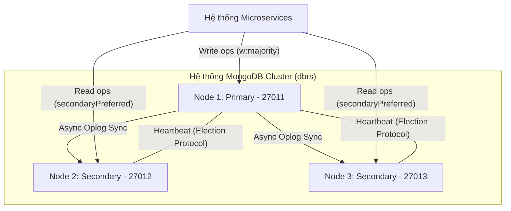
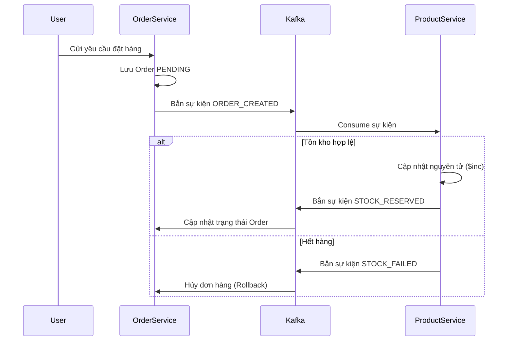

# BÁO CÁO BÀI TẬP LỚN: CƠ SỞ DỮ LIỆU PHÂN TÁN
## ĐỀ TÀI: XÂY DỰNG HỆ THỐNG SHOPEE CLONE VỚI MONGODB REPLICATION VÀ KIẾN TRÚC MICROSERVICES

---

## 2. PHÂN TÍCH VÀ THIẾT KẾ

### 2.2.1. PHÂN TÍCH

#### a. Các chức năng chính truy cập dữ liệu
Hệ thống Shopee Clone tập trung vào các luồng nghiệp vụ phân tán, đòi hỏi sự phối hợp chặt chẽ giữa các thành phần:
- **Thêm/Sửa/Xóa Đơn hàng**: Chức năng cốt lõi tại `Order Service`, yêu cầu bảo toàn dữ liệu giao dịch.
- **Cập nhật tồn kho**: Thực hiện tại `Product Service` thông qua các sự kiện bất đồng bộ. Đây là nơi áp dụng các kỹ thuật chống Race Condition (tranh chấp dữ liệu).
- **Xem sản phẩm (Query)**: Chức năng có tần suất truy cập cao nhất, được tối ưu hóa bằng cách đọc từ các bản sao (Secondaries).

#### b. Bảng tần suất truy cập (Access Matrix)
Việc phân bổ tải dựa trên tính chất của từng loại dữ liệu:

| Service | Chức năng | Collection | Loại truy cập | Tần suất | Chiến lược phân tán |
| :--- | :--- | :--- | :--- | :--- | :--- |
| **Product** | Xem danh sách | products | Đọc | Rất Cao | Đọc từ Secondaries (AP leaning) |
| **Order** | Tạo đơn hàng | orders | Ghi | Cao | Ghi vào Primary (CP strict) |
| **Product** | Giữ kho (Saga) | products | Ghi | Trung bình | Ghi vào Primary (Strong Consistency) |
| **Auth** | Đăng nhập | users | Đọc | Cao | Đọc từ Secondaries |

#### c. Tính cục bộ dữ liệu (Data Locality)
Tại sao chọn **Replication** thay vì **Sharding**?
- **Availability over Partition**: Với dự án Shopee Clone ở quy mô hiện tại, yêu cầu tính sẵn sàng (Availability) và chịu lỗi (Fault Tolerance) quan trọng hơn việc chia nhỏ dữ liệu theo phân mảnh vật lý. Replication giúp dữ liệu luôn có mặt ở 3 node, đảm bảo phục vụ khách hàng 24/7 ngay cả khi 1 node gặp sự cố.
- **Giảm độ trễ**: Khách hàng có thể đọc dữ liệu sản phẩm từ bất kỳ node Secondary nào gần họ nhất.

#### d. Phân quyền (Authorization)
- **Cơ chế Token (JWT)**: Bảo vệ các điểm cuối API, đảm bảo chỉ người dùng hợp lệ mới có quyền gửi yêu cầu tạo đơn hàng.
- **RBAC (Role-Based Access Control)**: Thiết lập phân quyền trực tiếp trong MongoDB, giới hạn quyền hạn của từng microservice đối với tập dữ liệu mà nó quản lý.

#### e. Mô hình dữ liệu Document
Hệ thống từ bỏ mô hình E-R truyền thống để chuyển sang **Document Model** giúp linh hoạt Schema và tăng tốc độ truy vấn.

---

### 2.2.2. THIẾT KẾ

#### a. Thiết kế CSDL Document
Cấu trúc dữ liệu được thiết kế dạng JSON-like, cho phép nhúng (embedding) các Snapshot dữ liệu để đảm bảo tính nhất quán lịch sử đơn hàng.

#### b. Thiết kế CSDL Phân tán (MongoDB Replica Set)
Mô hình cài đặt thực tế gồm 3 Node: **Primary (P)**, **Secondary (S1)**, **Secondary (S2)**.

**Cơ chế cốt lõi:**
- **Đồng bộ qua Oplog**: Mọi thay đổi trạng thái được ghi vào Primary và nhân bản sang bản sao.
- **Election (Bầu cử)**: Tự động khôi phục dịch vụ khi node chính bị sập trong vòng < 12 giây.

#### c. Phân tích dựa trên Định lý CAP
- **Default CP**: MongoDB đảm bảo tính Nhất quán khi đọc/ghi trên Primary.
- **AP leaning**: Khi thiết kế ứng dụng gọi hàm `readPreference: secondaryPreferred`, chúng ta hướng hệ thống tới sự cân bằng AP (Sẵn sàng + Chịu lỗi), chấp nhận dữ liệu có thể trễ vài mili giây để tối ưu trải nghiệm người dùng cuối.

#### d. Kiến trúc hệ thống & Luồng sự kiện (Saga Pattern)
Sử dụng **Saga Choreography** để quản lý giao tác phân tán mà không dùng LinkServer (SQL Server style).

---

## 3. CÀI ĐẶT VẬT LÝ THỰC TẾ

### 3.1. Cài đặt mạng (Docker Network)
Sử dụng Docker Bridge Network để thiết lập môi trường mạng ảo cho 8 Container nhìn thấy nhau qua Hostname.

### 3.2. Cài đặt MongoDB Replica Set
Triển khai thông qua lệnh `rs.initiate()` trong script khởi tạo.

### 3.3. Kiểm tra và Minh chứng thực tế

**Minh chứng 1: Khả năng Chịu lỗi và Bầu cử (Election)**
- Thực hiện dừng node Primary hiện tại.
- Kết quả `rs.status()` cho thấy node Secondary khác ngay lập tức được bầu lên làm Primary.
- **Chứng minh**: Hệ thống không bị gián đoạn (High Availability).

**Minh chứng 2: Tính Nguyên tử (Atomic Operations)**
- Code xử lý trừ kho sử dụng toán tử `$inc` và điều kiện lọc `{ quantity: { $gte: target } }`.
- **Chứng minh**: Đảm bảo không bao giờ xảy ra lỗi "bán quá số lượng" cho dù có hàng ngàn yêu cầu cùng lúc.

**Minh chứng 3: Sự đồng bộ trễ (Replication Lag)**
- Kiểm tra `rs.printSecondaryReplicationInfo()`.
- **Kết quả**: Độ trễ (lag) xấp xỉ 0s.
- **Chứng minh**: Cơ chế đồng bộ qua Oplog hoạt động hiệu quả trên nền tảng Docker nội bộ.

---

## TỔNG KẾT
Dự án đã áp dụng thành công các nguyên lý CSDL phân tán hiện đại trên nền tảng Microservices. Việc kết hợp MongoDB Replication và Kafka Saga giúp hệ thống vừa đảm bảo tính nhất quán dữ liệu giao dịch, vừa tối ưu hóa hiệu năng và khả năng mở rộng cho bài toán Shopee Clone.
