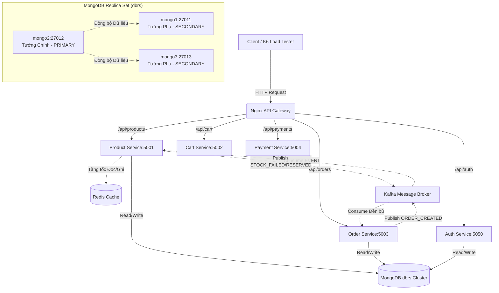
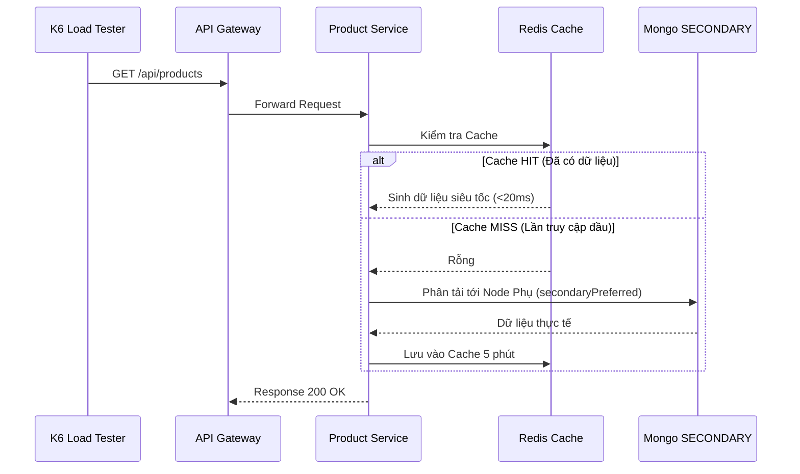
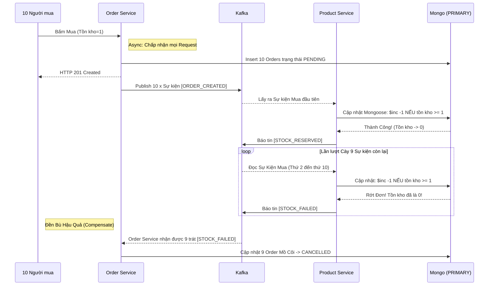
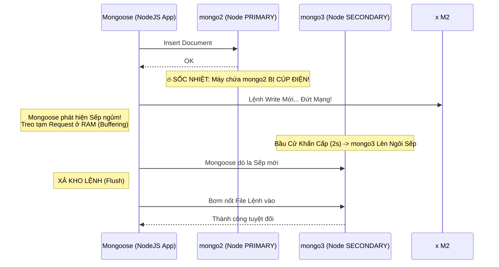

# Shopee Microservices Architecture

Dự án mô phỏng hệ thống thương mại điện tử (e-commerce) quy mô lớn sử dụng kiến trúc **Microservices**, tập trung vào tính nhất quán dữ liệu thông qua mô hình **Saga Choreography**, chịu tải cực cao với **CQRS + Redis**, và khả năng sống sót (Failover) với **MongoDB Replica Set**.

---

## 🚀 Công nghệ sử dụng

- **Backend**: Node.js, Express.js
- **Database**: MongoDB (với cụm Replica Set 3-Node để hỗ trợ Distributed Transactions & Failover)
- **Messaging**: Apache Kafka & Zookeeper (KafkaJS)
- **Caching**: Redis (Sử dụng Cache Aside trong Product Service)
- **Payment Gateway**: VNPay Sandbox
- **Testing**: Jest, Supertest, K6 (Load Testing)

---

## 🏗️ Sơ Đồ Kiến Trúc Hệ Thống

Hệ thống tuân thủ chặt chẽ nguyên lý Microservices, giao tiếp ngoại vi qua API Gateway và nội bộ qua Kafka.
<details>
<summary><b>Nhấn để xem Sơ đồ Kiến trúc (Mermaid)</b></summary>


</details>

---

## 🧪 Hệ Thống Kiểm Thử (Testing & Workflows)

Dự án cung cấp bộ các kịch bản kiểm thử hạng nặng ở thư mục `/scripts` để chứng minh sức mạnh kiến trúc. Để chạy các test này, bạn cần đảm bảo các môi trường (Kafka, MongoDB, Redis) và các Node Service đã được bật sẵn.

### 1. Luồng Chịu tải Cao (Performance Test)
- **Script:** `node scripts/performance-5000-req.js` (hoặc chạy bằng docker K6)
- **Mục đích:** Chứng minh hệ thống không bị "sập" khi có hàng ngàn user lướt trang cùng một thời điểm.
- **Cách chống chịu:** 
  1. Product Service đọc dữ liệu từ **Redis Cache**. Nếu Cache thiếu, nó gọi MongoDB.
  2. Tại MongoDB, kết nối được cấu hình **CQRS** `readPreference=secondaryPreferred`. Lệnh đọc không chạy vào Node xử lý Dữ liệu Vàng (Primary) mà dồn hết qua 2 Node Secondary rảnh rỗi.

<details>
<summary><b>Nhấn để xem Sơ đồ Tuần tự (Performance)</b></summary>


</details>

### 2. Luồng Chống Xung đột Kho & Vượt tồn kho (Race Condition / Saga)
- **Script:** `node scripts/race-condition-test.js`
- **Mục đích:** Đảm bảo khi 10 người cùng lúc giành mua chung 1 sản phẩm có số lượng = 1, sẽ chỉ có đúng 1 người mua được, không xảy ra Overselling (Bán lố càn).
- **Cách chống chịu:** Bằng sức mạnh **Eventual Consistency của Saga**. 
  - Order Service thu nhận đủ 10 đơn (Pending), đánh lừa user bằng một thông báo nhẹ nhàng (HTTP 201) rồi quăng sự kiện lên Kafka. 
  - Product Service lần lượt gỡ từng message ra. Nhờ khoá cấp dòng (Row-level Lock) của `findOneAndUpdate({ quantity: {$gte: 1} })` bên MongoDB, người đầu tiên trừ được kho về 0. 
  - 9 ông đi trễ sẽ bị văng lỗi. Product Service trả tin nhắn huỷ `STOCK_FAILED` lên Kafka. Order Service nhận được và âm thầm cập nhật 9 Order mồ côi kia thành `CANCELLED`.

<details>
<summary><b>Nhấn để xem Sơ đồ SAGA Choreography</b></summary>


</details>

### 3. Khả năng Sống sót sau Thảm hoạ (High Availability / Failover)
- **Mục đích:** Nếu ổ cứng của máy chủ chứa Database Cốt lõi (Primary) bị hỏa hoạn, hệ thống phải tự sửa chữa và sống sót.
- **Cách chống chịu:** Driver Node.js kết hợp cùng MongoDB Replica Set có khả năng Auto-Failover. 
  - Nếu Node Chính (`mongo2`) sập, liên kết bị đứt ngang. Mongoose thay vì làm Server Error Node.js thì sẽ Tạm giữ (Buffer) toàn bộ API Calls trên Memory. 
  - Sau 2-4 giây, Cụm Mongo phụ bỏ phiếu đôn Node Phụ lên làm Sếp Mới (`mongo3`). 
  - Mongoose phát hiện được, lập tức bắt ống nước qua đó, nhả toàn bộ Buffer data xuống. Kết quả: Ko thất thoát 1 Byte tín hiệu nào, User không hề biết Server vừa trải qua sinh tử!

<details>
<summary><b>Nhấn để xem Sơ đồ Phục Hồi Thảm Hoạ</b></summary>


</details>

---

## 🛠️ Hướng dẫn cài đặt & Chạy chuẩn

### 1. Yêu cầu hệ thống
- Node.js v18+
- Docker & Docker Compose (Rất quan trọng)

### 2. Cài đặt các service
```bash
npm install # Tại thư mục root và từng thư mục con trong /services
```

### 3. Cấu hình Biến môi trường (.env)
Đảm bảo tất cả file `.env` của 5 microservices trỏ dúng địa chỉ Liên Minh Replica Set:
```env
MONGO_URI=mongodb://mongo1:27011,mongo2:27012,mongo3:27013/shopee?replicaSet=dbrs&readPreference=secondaryPreferred
```

### 4. Vận hành Toàn Cục
1. Khởi động tầng Hạ tầng (Database, Messaging, API Gateway):
   ```bash
   docker-compose up -d
   ```
2. Cấy dữ liệu Giả (Seed DummyJSON) - **Bắt buộc**:
   ```bash
   node scripts/seed.js
   ```
3. Bật 5 NodeJS Service theo kiểu Debug song song:
   ```bash
   # Mở lần lượt từng terminal trong các folder dịch vụ và gõ:
   npm run dev
   ```

## 📄 Giấy phép

Dự án này được phát triển cho mục đích học tập chiến lược Hệ thống phân tán và bảo vệ luận án Microservices. Mọi tài sản thuộc về học viên và giảng viên đánh giá.
