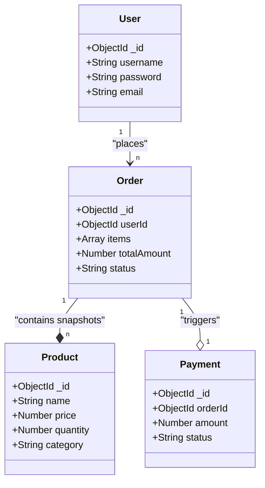
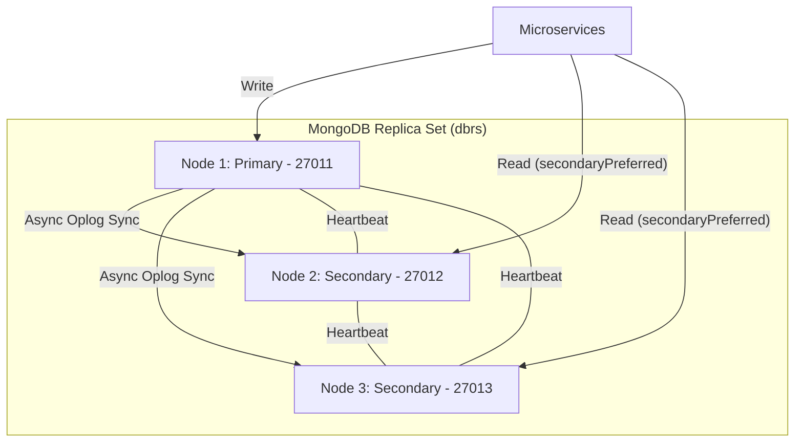
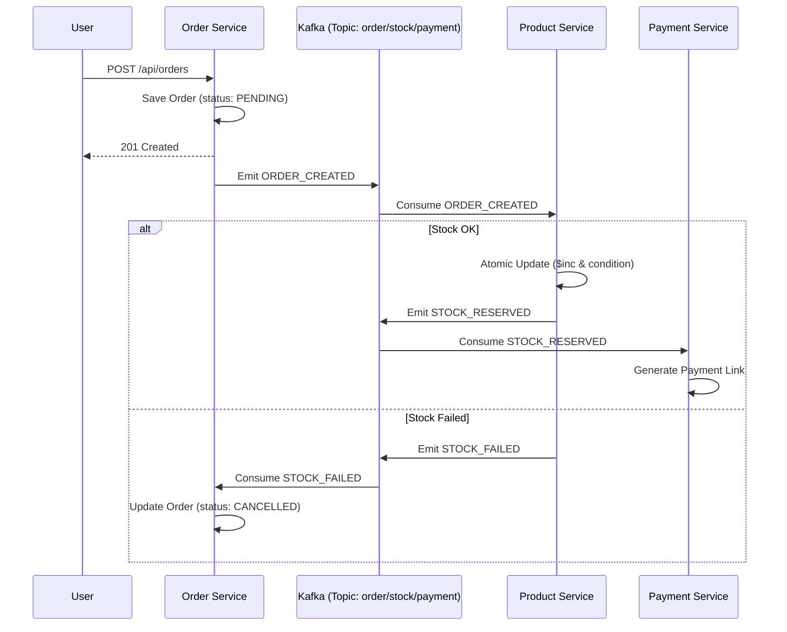

# BÁO CÁO BÀI TẬP LỚN: CƠ SỞ DỮ LIỆU PHÂN TÁN
## ĐỀ TÀI: Shopee Clone Microservices & MongoDB Replication

---

## 2. PHÂN TÍCH VÀ THIẾT KẾ

### 2.2.1. PHÂN TÍCH

#### a. Các chức năng chính truy cập dữ liệu
Hệ thống được thiết kế xoay quanh các giao tác phân tán giữa các Microservices. Các chức năng quan trọng nhất bao gồm:
- **Thêm/Sửa/Xóa Đơn hàng**: Thực hiện tại `Order Service`. Đây là chức năng quan trắc tính nhất quán của toàn hệ thống.
- **Cập nhật tồn kho**: Thực hiện tại `Product Service`. Yêu cầu tính nguyên tử (Atomicity) cực cao để tránh hiện tượng Over-selling (bán quá số lượng tồn kho).
- **Xem sản phẩm (Query)**: Thực hiện tại `Product Service`. Đây là chức năng có tải đọc lớn nhất.

#### b. Bảng tần suất truy cập (Access Matrix)
Việc phân tích tần suất truy cập giúp xác định chiến lược phân tán dữ liệu phù hợp (Replication vs Sharding).

| Service | Chức năng | Collection | Loại truy cập | Tần suất | Đặc điểm tải | Chiến lược đề xuất |
| :--- | :--- | :--- | :--- | :--- | :--- | :--- |
| **Product** | Xem danh sách | products | Đọc | Rất Cao | Read-Heavy | Đọc từ Secondaries |
| **Order** | Tạo đơn hàng | orders | Ghi | Cao | Write-Heavy | Ghi vào Primary (Strong Consistency) |
| **Product** | Giữ kho (Saga) | products | Ghi | Trung bình | Transactional | Ghi vào Primary |
| **Auth** | Đăng nhập | users | Đọc | Cao | Metadata Read | Đọc từ Secondaries |

- **Lý do sử dụng Replication**: Hệ thống Shopee Clone yêu cầu tính sẵn sàng (`Availability`) và hiệu năng đọc cực lớn cho khách hàng xem sản phẩm. Thay vì dùng Sharding (vốn phức tạp cho việc quản lý Cluster), chúng ta chọn **MongoDB Replication** để tách biệt luồng Đọc/Ghi (Read/Write Splitting).

#### c. Phân biệt Cục bộ dữ liệu (Data Locality)
Chúng ta áp dụng **Phân mảnh theo chức năng (Functional Fragmentation)**:
- Mỗi Microservice làm chủ hoàn toàn dữ liệu của mình (Database per Service).
- Dữ liệu `Product` được nhân bản (Replication) ra 3 node để đảm bảo khách hàng ở bất kỳ đâu cũng có thể truy cập với độ trễ thấp nhất.

#### d. Phân quyền (Authorization)
- **Mức Ứng dụng**: Sử dụng **JWT (JSON Web Token)** để xác thực người dùng giữa các Microservices qua API Gateway (Nginx).
- **Mức Database**: Sử dụng **RBAC (Role-Based Access Control)** của MongoDB. Mỗi Microservice chỉ có quyền truy cập vào Database/Container riêng của mình thông qua Connection String có User/Pass riêng biệt.

#### e. Mô hình thực thể liên kết (E-R) sang Document Model
Thay vì sử dụng mô hình quan hệ (RDBMS) cứng nhắc, hệ thống sử dụng **Document Model (NoSQL)** để tối ưu tốc độ và khả năng mở rộng.

---

### 2.2.2. THIẾT KẾ

#### a. Thiết kế CSDL Document
Mỗi Service quản lý một Database riêng trên cùng một Replica Set Cluster.

- **Product Schema**: Lưu trữ thông tin sản phẩm. Đặc biệt sử dụng `optimisticConcurrency: true` và `versionKey` để chống Race Condition khi cập nhật tồn kho.
- **Order Schema**: Lưu trữ thông tin đơn hàng. Điểm đặc biệt là **Schema Snapshots**: Lưu lại tên và giá sản phẩm tại thời điểm mua vào trong mảng `items` thay vì chỉ lưu `productId`. Điều này đảm bảo tính lịch sử của dữ liệu khi sản phẩm thay đổi giá trong tương lai.

#### b. Thiết kế CSDL Phân tán (MongoDB Replica Set)
Kiến trúc cốt lõi dựa trên mô hình **1 Primary - 2 Secondaries**.

**Cơ chế hoạt động:**
1. **Đồng bộ Oplog**: Mọi thao tác ghi vào Primary sẽ được ghi lại vào `oplog.rs`. Các Secondaries sẽ liên tục kéo (pull) dữ liệu từ oplog này để cập nhật bản sao của mình.
2. **Bầu cử (Election)**: Nếu Primary bị sập, các Secondary sẽ sử dụng giao thức Raft-like để bầu ra Primary mới dựa trên độ ưu tiên (priority) và độ mới của dữ liệu.
3. **Read/Write Splitting**:
   - **Ghi**: Luôn vào Primary để đảm bảo tính nhất quán tuyệt đối.
   - **Đọc**: Cấu hình `readPreference: secondaryPreferred`. Hệ thống ưu tiên đọc từ các node Secondary để giảm tải cho Primary, nâng cao tốc độ ứng dụng.

#### c. Phân tích dựa trên Định lý CAP
Kiến trúc MongoDB Replica Set mặc định là hệ thống **CP (Consistency & Partition Tolerance)**:
- **Consistency**: Với `writeConcern: majority`, dữ liệu chỉ được xác nhận thành công khi đã ghi vào đa số các node (2/3 node).
- **Availability**: Hệ thống vẫn hoạt động nếu ít nhất 2 node còn sống.
- **Sự chuyển dịch sang AP**: Khi sử dụng `readPreference: secondaryPreferred`, chúng ta chấp nhận tính Nhất quán yếu (Eventual Consistency) để đổi lấy Khả năng sẵn sàng và Hiệu năng cực cao cho người dùng cuối $\rightarrow$ Phù hợp hoàn hảo với bài toán Shopee.

#### d. Kiến trúc hệ thống & Saga Pattern
Luồng xử lý giao tác phân tán qua **Kafka (Saga Choreography)**.

